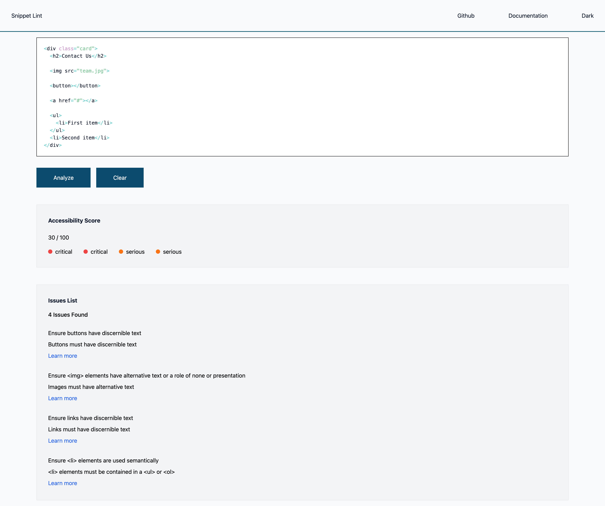
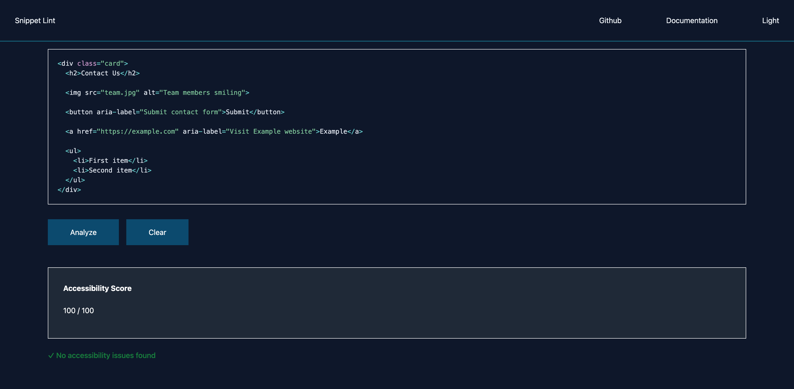

# SnippetLint

SnippetLint is a lightweight accessibility auditing tool for HTML snippets.
It helps developers catch accessibility issues early, without setting up a full project.
Using axe-core, it returns a weighted accessibility score, a list of violations, and links to documentation, so you know what to fix and why.

🔗 **Live Demo:** [snippetlint.netlify.app](https://snippetlint.netlify.app)

---

## Screenshots




---

## Features

- Paste any HTML snippet and run an instant accessibility audit
- Accessibility score out of 100, calculated by violation severity
- Color-coded severity indicators (critical, serious, moderate, minor)
- Detailed issue list with descriptions and links to Deque documentation
- Snippet persistence via localStorage with debounced autosave
- Dark / Light mode toggle
- Fully responsive layout

---

## Tech Stack

- **React 18 and Typescript**
- **axe-core** 
- **Tailwind CSS** 
- **react-simple-code-editor** + **Prism.js** 
- **Vite** 

---

## Getting Started

### Prerequisites

- Node.js 18+
- npm

### Installation
```bash
git clone https://github.com/DavideCannerozzi/SnippetLint.git
cd SnippetLint
npm install
npm run dev
```

Open [http://localhost:5173](http://localhost:5173) in your browser.

---

## Project Structure
```
src/
 ├─ components/        # UI components
 │   ├─ AnalyzerButton/
 │   ├─ CodeEditor/
 │   ├─ Header/
 │   ├─ IssuesList/
 │   ├─ PrimaryButton/
 │   └─ ScoreDisplay/
 ├─ hooks/             # Custom hooks
 │   ├─ useAnalyzer.ts
 │   └─ useTheme.ts
 ├─ types/             # Shared TypeScript types
 │   └─ index.ts
 └─ App.tsx
```

---

## How It Works

1. Paste an HTML snippet into the editor
2. Click **Analyze**
3. axe-core injects the snippet into a hidden DOM node and runs its accessibility audit
4. Results are displayed as a score and a categorized list of violations

---

## Scoring

Violations are weighted by impact level:

| Impact   | Weight |
|----------|--------|
| Critical | 25     |
| Serious  | 10     |
| Moderate | 5      |
| Minor    | 1      |

The final score is `Math.max(0, 100 - total weight)`.

---

## License

MIT — [Davide Cannerozzi](https://www.linkedin.com/in/davide-cannerozzi-developer/)
